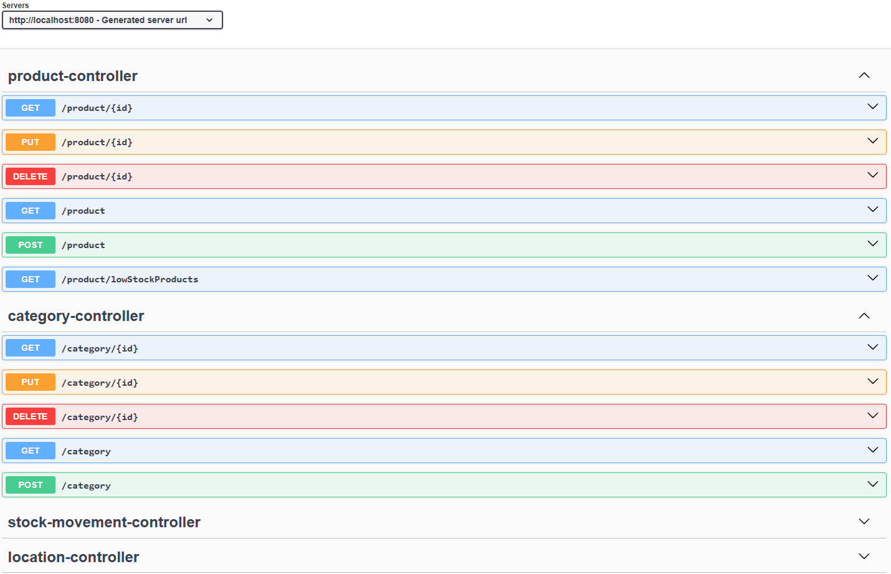
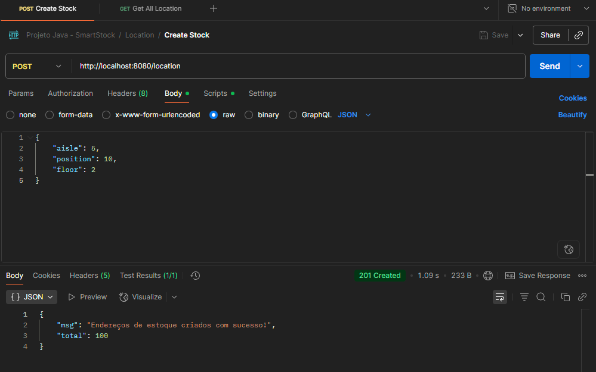

# SmartStock - Aplicação para Controle de Estoque 

```Projeto em fase de testes```

Este projeto é uma API REST para gerenciamento de estoque de empresas, desenvolvida com Java e Spring Boot.

### O sistema permite:

- Cadastro e gerenciamento de endereços de estoque (prateleiras) de forma sistêmica, possibilitando visualizar quais posições estão disponíveis ou ocupadas fisicamente.
- Controle de produtos, categorias e movimentações de entrada e saída, garantindo rastreabilidade completa das operações.
- Histórico detalhado de movimentações, permitindo consultar todas as alterações realizadas no estoque.
- Monitoramento de níveis de estoque, com indicação de produtos que estão com quantidade baixa e necessitam reposição.
- O objetivo do sistema é fornecer um controle eficiente e centralizado do estoque, ajudando empresas a reduzir erros operacionais e melhorar a gestão de seus produtos.


## 🚀 Tecnologias Utilizadas

- **Java** -  linguagem principal do projeto.
- **Spring Boot** - framework para construção da API REST.
- **Spring Data JPA** - persistência de dados e integração com o banco.
- **Lombok** - biblioteca para reduzir boilerplate no Java.
- **Swagger/OpenAPI** - documentação e teste interativo da API.
- **Junit 5** - criação de testes unitários.
- **Mockito** - mock de dependências nos testes.
- **H2 Database** - banco em memória utilizado nos testes.
- **MySQL** - banco de dados relacional utilizado.
- **Maven** - gerenciamento de dependências e build do projeto.
- **Postman** - teste e documentação dos endpoints da API.

## Exemplo de Requisições no Swagger UI



## Vizualização de Dados no Postman



## Vizualização do Banco de Dados


## Como Rodar o Projeto

- [MySQL](https://dev.mysql.com/downloads/) instalado.

### 📝 Passo a passo

1. **Baixe e instale o MySQL.**

   Caso ainda não tenha instalado, baixe em [MySQL Downloads](https://dev.mysql.com/downloads/).

2. **Crie o banco de dados no MySQL.**

   ```sql
   CREATE DATABASE smartstock;

3. **Execute o projeto como aplicação Spring Boot.**

    Na IDE, clique para rodar como Spring Boot Application ou utilize o comando abaixo no terminal:
    ```bash
    ./mvnw spring-boot:run
    ```
4. **Acesse o Swagger UI pelo seu navegador.**

    [Link do Swagger UI](http://localhost:8080/swagger-ui/index.html).

    Faça as requisições pelo Postman se desejar, use a documentação do Swagger para realizar as requisições.

5. **Agora é só vizualizar os dados no MySQL.**
    
    Conecte no banco de dados e visualize os dados inseridos pelas requisições realizadas.

<br><br>

## 🙋 Sobre o Autor

Desenvolvido por Jefferson Sousa  
[GitHub](https://github.com/JeffSSousa) | [LinkedIn](https://www.linkedin.com/in/jefferson-sousa-8b93a81a2/)